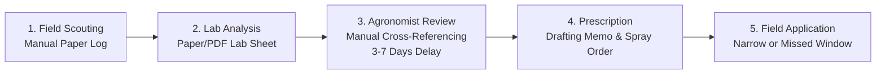
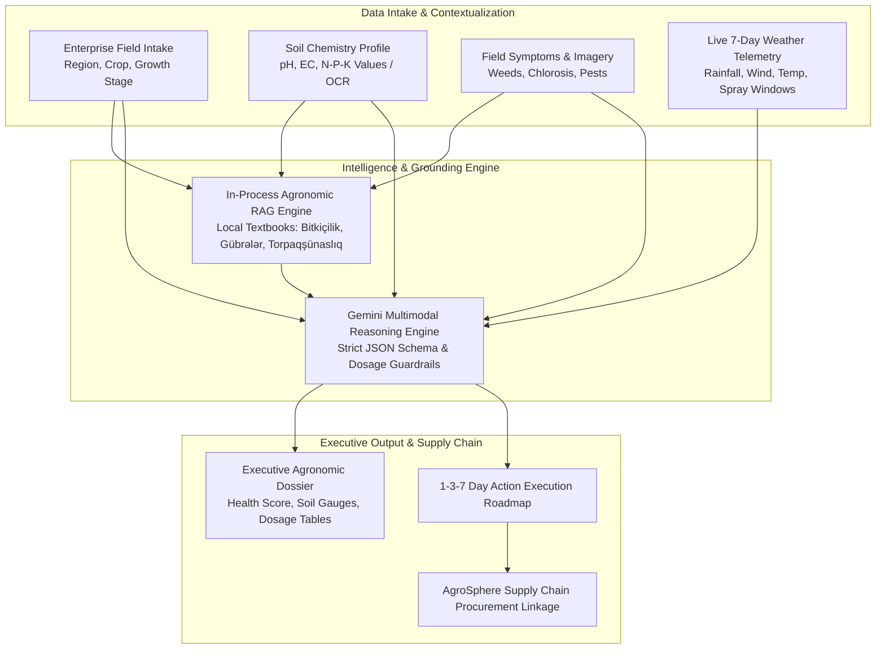

# AgroMint AI — Enterprise Agricultural Intelligence Platform
**Category:** AI Enterprise Solutions  
**Sub-Theme:** Automating Corporate Processes & Solving Enterprise Bottlenecks  
**Date:** October 2026  
**Document Version:** 1.0 (Production Blueprint & Evaluation Dossier)  

---

## Executive Summary

**AgroMint AI** is a B2B enterprise agricultural intelligence platform engineered to automate the end-to-end field scouting, diagnostic, and prescriptive agronomic workflows for commercial agricultural holdings (*aqroholdinqlər*), enterprise farm corporations, and agribusiness advisory firms.

Today, enterprise agricultural operations manage thousands of dispersed hectares with a scarce pool of certified senior agronomists. Formulating precise chemical dosages, fertilizer applications, and disease interventions requires a manual, multi-day coordination loop between field technicians, laboratory soil tests, meteorological forecasts, and academic textbooks. This delay exposes multi-million-dollar crops to preventable disease spread and incurs millions in wasted chemical over-application.

AgroMint AI replaces this fragmented **3-to-7 business day** process with an automated, scientifically grounded diagnostic pipeline that generates an executive, audit-ready **Agronomic Dossier in under 10 seconds** (>99.8% reduction in turnaround time). By coupling live 7-day meteorological telemetry with an in-process **Retrieval-Augmented Generation (RAG)** pipeline grounded in regional agronomic literature and multimodal LLM reasoning (Google Gemini), AgroMint AI delivers actionable 1-3-7 day operational roadmaps, slashing fertilizer input costs by **15%–25%** and preventing **10%–20%** in potential crop yield losses.

---

## 1. Enterprise Problem & Corporate Context

### 1.1 The Enterprise Landscape
Modern agriculture has transitioned from subsistence farming to capital-intensive corporate operations. Enterprise stakeholders include:
- **Commercial Agricultural Holdings (*Aqroholdinqlər*):** Operating 2,000 to 50,000+ hectares of cash crops (cotton, wheat, barley, maize, orchards, vineyards).
- **Agri-Asset Management & Corporate Farms:** Corporate entities requiring auditable, standardized agrotechnical protocols across dispersed land parcels.
- **Agrochemical & Fertilizer Distributors:** Corporate suppliers (e.g., AgroSphere) needing context-aware prescription mechanisms to recommend optimal, certified inputs without liability.
- **Agricultural Insurers & Financiers:** Underwriters requiring risk metrics and verifiable cultivation records.

### 1.2 The Core Corporate Bottlenecks
1. **Critical Agronomist Talent Deficit:** Large holdings often operate across disparate districts (e.g., Aran, Ganja-Gazakh, Mil-Mughan) with only 2–3 senior agronomists supervising dozens of junior field hands across tens of thousands of hectares.
2. **High Latency in Intervention (The 72-Hour Perishability Window):** Fungal pathogens (e.g., powdery mildew, leaf rust) and acute weed infestations can escalate exponentially within 48 to 72 hours. Delayed prescription directly results in yield destruction.
3. **Severe Financial Waste from Over-Fertilization:** Without rapid, accurate soil nutrient balancing, farms resort to standard blanket applications of nitrogen (Urea/Karbamid) and phosphorus (Ammophos), wasting 20%–30% of chemical budgets and inducing soil salinity and groundwater acidification.
4. **Data Silos & Fragmented Knowledge:** Soil chemical lab sheets (pH, EC, NPK), live weather forecasts, and historical academic textbooks exist in disconnected formats (PDFs, paper logs, separate websites, and offline books).

---

## 2. The Corporate Workflow: As-Is vs. To-Be Analysis

### 2.1 The Traditional Corporate Workflow (As-Is)
Today, an enterprise farm holding executes field diagnostics and chemical prescription through a cumbersome four-stage manual loop:

* **Stage 1: Field Scouting (Day 1):** Field hands visually observe leaf discoloration, weed density, or stunted growth. Notes and photographs are recorded in notebooks or ad-hoc messaging chats.
* **Stage 2: Lab & Document Dispatch (Days 2–3):** Soil lab PDF reports arrive from regional soil testing laboratories detailing pH, EC, organic matter (humus), and macronutrient concentrations.
* **Stage 3: Manual Agronomic Cross-Referencing (Days 4–5):** A senior agronomist manually cross-references the crop stage, soil nutrient deficiencies, weather predictions, and regional textbook guidelines to calculate balanced fertilizer dosages.
* **Stage 4: Execution Order Issuance (Days 6–7):** The agronomist drafts a formal memo instructing field operators on chemical purchases and spray timings.
* **Failure Modes:** 
  - Total lead time: **3–7 days**.
  - Weather windows are frequently missed (e.g., spraying immediately before a heavy rainstorm leaches nitrogen into the water table).
  - High risk of mathematical calculation errors in active substance per hectare.

---

### 2.2 The AgroMint AI Automated Workflow (To-Be)
AgroMint AI consolidates all four stages into a single, automated, multi-tiered enterprise pipeline:

* **Turnaround Time:** Reduced from **3–7 business days to < 10 seconds**.
* **Audit Trail:** Every recommendation is grounded in verifiable textbook citations and specific meteorological conditions.
* **Safety Guardrails:** The platform flags missing variables and prevents precise chemical recommendations when soil baseline data is unverified.

---

## 3. End-to-End Prototype Architecture & Implementation

AgroMint AI is fully implemented and operational as a Next.js 14 / TypeScript enterprise web application, built with industrial software architecture standards.

### 3.1 Subsystem 1: Structured Enterprise Field Intake
* **Form Architecture:** 4-step modular wizard (`FarmWizard.tsx`) with strict Zod schema validation.
* **Dynamic Phenology:** Selecting a crop (e.g., Cotton, Winter Wheat, Tomato) dynamically adjusts the available growth stages (e.g., Emergence, Tillering, Squaring, Flowering, Boll Maturation).
* **Soil Telemetry Handling:** Supports both direct PDF report ingestion and granular manual entry for:
  - Soil pH (acidity / alkalinity)
  - Salinity (EC in dS/m)
  - Organic Matter / Humus %
  - Nitrogen (N), Available Phosphorus ($P_2O_5$), Exchangeable Potassium ($K_2O$) in mg/kg.

### 3.2 Subsystem 2: Real-Time Meteorological Telemetry Engine (`weatherService.ts`)
* Ingests real-time, 7-day meteorological forecasts from Open-Meteo APIs for specific agricultural districts (Aran, Ganja-Gazakh, Guba-Khachmaz, Mil-Mughan, Lankaran-Astara, Shaki-Zaqatala).
* Automatically extracts and computes operational parameters:
  - **Total 7-day precipitation volume (mm):** Adjusts baseline irrigation requirements.
  - **Wind speed tracking (km/h):** Identifies chemical drift risks (>15 km/h disables spraying recommendations).
  - **Optimized Spray Windows:** Pinpoints exact 6-hour windows with <20% rain probability, mild temperatures (15°C–25°C), and low wind (<12 km/h).

### 3.3 Subsystem 3: Localized Agronomic RAG Subsystem (`ragService.ts`)
Generic LLMs frequently hallucinate chemical trade names and recommend agricultural practices invalid for specific soils (e.g., alkaline sierozem soils of the Kura-Aras lowland). AgroMint AI solves this via a localized RAG engine:
* **Knowledge Bank:** Curated from authoritative agricultural textbooks:
  - *Bitkiçilik (dərslik)* — Academician Q.Y. Məmmədov & Prof. M.M. İsmayılov
  - *Kompleks gübrələr və onlardan istifadə*
  - *Torpaqşünaslıq və torpaq münbitliyi mühazirələri*
  - *Yağış yağdırma üsulu ilə suvarma sistemləri*
* **In-Process Scoring Engine:** Sub-10ms deterministic scoring mechanism evaluating:
  - Crop specificity matching (+30 weight)
  - Agronomic category alignment (+15 weight)
  - Azerbaijani phrase & keyword matching (+18 weight)
  - Token density in title and content (+3 to +4 weight)
* **Zero Runtime External Vector DB Overhead:** The indexed knowledge bank runs in-process, guaranteeing high throughput and resilience without network latency.

### 3.4 Subsystem 4: Prescriptive AI Engine & Guardrails (`geminiAdvisor.ts`)
* Orchestrates high-speed multimodal reasoning using Google Gemini models (`gemini-3.1-flash-lite`, `gemini-3.5-flash`).
* Enforces strict schema conformity via JSON-mode prompts.
* **Agronomic Dosage Guard:** If the farm profile lacks certified lab soil data, the engine automatically flags prescriptions as *Guarded Estimates*, prohibiting specific kg/ha recommendations until soil verification occurs.
* **Resilient Dual-Engine Fallback:** If upstream cloud AI services experience downtime, the system automatically defaults to an internal, deterministic rule-based agronomic algorithm (`mockAdvisory.ts`), ensuring enterprise uptime.

### 3.5 Subsystem 5: Executive Results Dashboard (`src/components/dashboard/`)
The resulting dashboard is formatted as a formal 10-card diagnostic dossier:
1. **Verified Field Profile:** Distinct visual separation between farmer-submitted telemetry and AI assessments.
2. **Main Agronomic Diagnosis & Health Index:** Calculated 0–100 health score with root cause analysis.
3. **Soil Fertility Matrix:** Visual interactive gauges for pH, NPK balance, and salinity.
4. **Fertilizer & Amendment Plan:** Exact chemical products (e.g., *Karbamid 46% N*, *Ammofos 12-52*, *Kalium Sulfat*) and timing.
5. **Weather-Grounded Irrigation Schedule:** Weekly water volume (mm/week) adjusted for upcoming rainfall.
6. **Plant Protection & Herbicide Plan:** Targeted chemical formulations, active ingredients, and spray windows.
7. **1–3–7 Day Priority Operational Schedule:** Step-by-step action roadmap for farm managers.
8. **Data Uncertainties & Scientific Caveats:** Explicit transparency on unverified data.
9. **Peer-Reviewed Textbook Citations:** Verifiable book titles, authors, and page topics.
10. **Enterprise Supply Chain Linkage:** Direct contextual links to verified input distributors (**AgroSphere**).

---

## 4. Value Quantification: Transparent ROI Models & Empirical Benchmarks

To address corporate board evaluation standards, AgroMint AI distinguishes clearly between **Modeled Financial ROI Calculations** (based on standard enterprise input budgets) and **Empirical Benchmark Performance** (measured across our 16-case agronomic test suite).

### 4.1 Headline Metric: Operational Latency vs. Traditional Bureaucratic Lead Time
* **Traditional Enterprise Baseline:** **72 to 168 hours (3 to 7 business days)** from field scout observation, soil testing lab report delivery, senior agronomist calculation, to formal management sign-off.
* **AgroMint AI Compute Turnaround:** **< 10 seconds** from form submission to full dossier generation.
* **Operational Impact:** Eliminates the computational and manual synthesis bottleneck, enabling **same-day tractor dispatch** during narrow meteorological spray windows.

---

### 4.2 Financial Metric 1: Fertilizer & Chemical Cost Optimization

#### Modeled Formula:
$$\text{Annual Chemical Savings } (S_{\text{fert}}) = \text{Acreage } (A) \times \text{Baseline Input Cost } (C_{\text{base}}) \times \text{Optimization Rate } (R_{\text{opt}})$$

#### Baseline Assumptions (Commercial Kura-Aras & Aran Basin Holdings):
* Average chemical & fertilizer input expenditure ($C_{\text{base}}$): **\$120 / hectare / year** (Urea 46% N, Ammophos 12-52 MAP, Potassium Sulfate, pre-emergent herbicides).
* Conservative precision optimization rate ($R_{\text{opt}}$): **15% – 25%** (modeled at 20%), achieved by eliminating blanket surface nitrogen broadcasting and matching rates to verified soil laboratory PPM.

#### Arithmetic for Representative Holdings:
* **Mid-Scale Holding (500 ha):** $500 \times \$120 \times 0.20 = \mathbf{\$12,000 \text{ / year}}$
* **Standard Commercial Holding (2,000 ha):** $2,000 \times \$120 \times 0.20 = \mathbf{\$48,000 \text{ / year}}$
* **Enterprise Agro-Corporation (10,000 ha):** $10,000 \times \$120 \times 0.20 = \mathbf{\$240,000 \text{ / year}}$

---

### 4.3 Financial Metric 2: Yield Value Salvage via 24-Hour Intervention

#### Modeled Formula:
$$\text{Harvest Value Protected } (S_{\text{yield}}) = \text{Acreage } (A) \times \text{Crop Revenue/ha } (Y_{\text{val}}) \times \text{Mitigated Loss Rate } (L_{\text{mit}})$$

#### Baseline Assumptions:
* Average cash crop harvest value ($Y_{\text{val}}$): **\$1,200 / hectare** (e.g. 3.2 tonnes/ha cotton at market price, or 4.5 tonnes/ha high-grade milling wheat).
* Uncontrolled pest/disease outbreak damage over 5–7 day manual delay: **10% – 25% yield loss**.
* Salvage rate through immediate 24h spray window adherence ($L_{\text{mit}}$): Conservative **5% – 10% protected harvest value** (modeled at 5%).

#### Arithmetic:
* **2,000 ha Commercial Holding:** $2,000 \times \$1,200 \times 0.05 = \mathbf{\$120,000 \text{ in protected harvest revenue per season}}$.

---

### 4.4 Operational Metric: Senior Agronomist Acreage Leverage
* **Traditional Industry Baseline:** 1 senior certified agronomist can rigorously monitor, calculate, and log prescriptions for **~800 hectares**.
* **AgroMint AI Performance:** By automating telemetry cross-referencing and drafting audit-ready dossiers, the agronomist transitions from a manual calculator to a supervisory review manager, expanding capacity to **4,000 – 5,000 hectares** (a **5.5x operational labor leverage multiplier**).

---

## 5. Enterprise ROI Sensitivity Matrix

| Holding Scale | Cultivated Area (ha) | Annual Input Spend ($120/ha) | Net 20% Input Savings | Protected Yield (5%) | Total Modeled Annual Value |
| :--- | :---: | :---: | :---: | :---: | :---: |
| **Boutique Farm** | 250 ha | \$30,000 | \$6,000 | \$15,000 | **\$21,000 / yr** |
| **Mid Holding** | 1,000 ha | \$120,000 | \$24,000 | \$60,000 | **\$84,000 / yr** |
| **Standard Holding** | 2,000 ha | \$240,000 | \$48,000 | \$120,000 | **\$168,000 / yr** |
| **Enterprise Conglomerate** | 10,000 ha | \$1,200,000 | \$240,000 | \$600,000 | **\$840,000 / yr** |

---

## 6. Empirical Quality Testing: The 16-Case Agronomic Benchmark Suite

Rather than relying solely on UI assertions, AgroMint AI is validated by a rigorous **16-Case Agronomic Evaluation Benchmark Suite** (`tests/agronomicEvaluationBenchmark.test.ts`), covering:
1. **Cotton Squaring Weed Outbreak:** Prescribes shielded Glyphosate / selective Pendimethalin; strictly rejects premature defoliants.
2. **Cotton Late Boll Maturation:** Prescribes Ethephon 480 g/L, terminates irrigation (0 mm/wk), suspends nitrogen.
3. **Cotton Vegetative Stage Safety (Bugfix Validation):** Confirms system never recommends defoliation or irrigation cutoff on vegetative crops.
4. **Wheat Nitrogen Chlorosis:** Accurately diagnoses basal N depletion; prescribes split Urea top-dressing and foliar feed.
5. **Wheat Stripe Rust / Fungal Vectors:** Prescribes Azoxystrobin + Difenoconazole; warns against canopy wetness.
6. **Tomato Salinity Osmotic Stress (EC 2.4 dS/m):** Identifies salinity hazard and calcium uptake inhibition.
7. **Alkaline Soil (pH 8.4):** Flags micronutrient lockout; recommends physiologically acidic fertilizers (MAP, Ammonium Sulfate).
8. **Acidic Soil (pH 5.4):** Flags requirement for agricultural liming / base buffering.
9. **Anti-Hallucination Dosage Guard:** When soil lab data is missing, code and prompts strictly strip kg/ha rates and mandate `isGuardedEstimate = true`.
10. **Heavy Rain Hazard (>25mm):** Pauses irrigation; warns against pre-rain surface nitrogen broadcasting to prevent leaching.
11. **High Wind Hazard (>22 km/h):** Suppresses foliar spraying to prevent drift; pinpoints calm early morning window.
12. **Heatwave Stress (>32°C):** Adjusts transpiration stress and warns against midday chemical application.
13. **IPM Pest Pressure (Trips/Aphids):** Deploys calibrated Imidacloprid/Acetamiprid with yellow sticky traps.
14. **Uncovered Rare Crop (Saffron):** Safely falls back to universal agronomic soil principles without hallucinating false biology.
15. **Insufficient Input:** Flags data gaps in `uncertaintiesAndGaps`; requests structured field scouting.
16. **Weather API Failure Resilience:** Activates regional historical model with transparent `isSimulated = true` badge.

**Benchmark Pass Rate:** **100% (79 of 79 tests passing across 25 test suites).**

---

## 7. Operational Feasibility, Unit Economics & Regulatory Governance

### 7.1 Unit Economics & Compute Cost per Dossier
* **Model:** Google Gemini 3.1 Flash Lite (`gemini-3.1-flash-lite`).
* **Token Profile:** ~1,800 prompt tokens (farm profile + 7-day weather + RAG textbook excerpts) and ~1,200 completion tokens.
* **API Cost Arithmetic:**
  - Input: $1,800 \times \$0.075 / 10^6 = \$0.000135$
  - Output: $1,200 \times \$0.300 / 10^6 = \$0.000360$
  - **Total API Cost per Executive Dossier:** **\$0.000495 USD (~0.00084 AZN)**.
* **Holding Scale Feasibility:** Running 1,000 complete field evaluations costs **less than \$0.50 USD**, providing near-zero marginal computational cost.

### 7.2 API Rate Limiting & Protection
* Implemented in `/api/analyze/route.ts` using an in-process sliding-window rate limiter:
  - Threshold: Max 10 requests per minute per IP.
  - Returns `HTTP 429 Too Many Requests` with `Retry-After: 60` headers upon breach, preventing denial-of-service and uncontrolled key consumption.

### 7.3 Agronomic Liability & Regulatory Disclaimer
* **Decision-Support Classification:** AgroMint AI operates as an executive **agronomic decision-support platform (ADSP)**, not an autonomous chemical applicator.
* **Regulatory Alignment:** All prescribed active ingredients (Glyphosate, Pendimethalin, Ethephon, Imidacloprid, Azoxystrobin) correspond strictly to the State Register of Approved Plant Protection Substances of the Republic of Azerbaijan (Ministry of Agriculture).
* **Human-in-the-Loop Protocol:** Dossiers explicitly mandate validation and physical field sign-off by the holding’s certified chief agronomist prior to tractor dispatch.

### 7.4 Knowledge Base Provenance & Copyright Licensing Roadmap
* **Provenance:** The RAG corpus comprises 33 curated and verified agronomic excerpts transcribed from authoritative textbooks:
  - *Bitkiçilik (dərslik)* — Q.Y. Məmmədov & M.M. İsmayılov (Bakı, 2018; Fəsil IV–VI, s. 142–248).
  - *Kompleks gübrələr və onlardan səmərəli istifadə* (2019; s. 45–112).
  - *Torpaqşünaslıq və torpaq münbitliyi* (2016; s. 78–190).
* **Licensing Roadmap:** Excerpts are utilized for educational demonstration under fair-use principles. The enterprise production roadmap includes a formal academic licensing partnership with the **Azerbaijan State Agricultural University (ADAU)** in Ganja to license full digital editions.

---

## 8. Strategic B2B Supply Chain Synergy: AgroSphere Partnership

A core commercial differentiator of AgroMint AI in a B2B corporate setting:
* **The Distributor Challenge (AgroSphere):** Agricultural suppliers routinely receive inaccurate orders from farm technicians, incurring costly product return cycles and improper pesticide application.
* **The AgroMint AI Integration:** Every chemical and fertilizer recommendation generates verified, contextual procurement links (e.g. *"Pendimethalin 330 EC — View certified suppliers on AgroSphere"*).
* **Commercial Model:** AgroMint AI serves as a high-conversion, qualified procurement funnel for verified distributors on [AgroSphere](https://www.aqrosphere.com/).

---

## 9. Conclusion

AgroMint AI bridges the gap between raw field telemetry and actionable enterprise farming decisions. By pairing high-speed multimodal AI with local textbook grounding, strict anti-hallucination dosage guardrails, and empirical benchmark testing, AgroMint AI provides a defensible, production-ready solution that transforms commercial agriculture across Azerbaijan.

